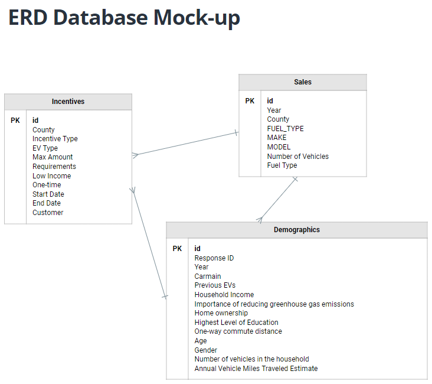

# California EV Dreams
A collaborative project to determine what factors drive ownership of electric vehicles in California.

## Table of contents
* [Overview of Project](#overview-of-project)
* [Communication Protocols](#communication-protocols)
* [Data Collection and Cleaning](#data-collection-and-cleaning)
* [Database Model](#database-model)
* [Machine Learning Model](#machine-learning-model)
* [Results](#results)
* [Summary](#summary)

### Resources
- Data Source: CA_county_incentives.csv, [demographics.csv](https://datadryad.org/stash/dataset/doi:10.25338/B8P313), [ZEV_Sales.csv](https://www.energy.ca.gov/data-reports/energy-almanac/zero-emission-vehicle-and-infrastructure-statistics/new-zev-sales)
- Tools: Python 3.7.13, Jupyter Notebook, Excel

## Overview of Project
The purpose of this project is to analyze factors that contribute to EV purchases in the state of California. At a more granular level, we will be looking at factors within California counties to determine any relevant factors that contribute most to purchases. The primary data point we will be using for our analysis is the total amount of incentives offered by county. As supplementary factors, we will be looking at demographic data to identify any correlation between household income, commuter miles driven, etc, and EV ownership. Using this analysis we hope to be able to accurately predict whether someone will buy an EV and present to manufacturers the strengths and weaknesses in their market and potential improvements that can be made.

Hypothesis: The 3 major factors improve EV sales/ownership in counties with at least X values for those factors.
- What is the opportunity in identifying a gap in this dataset?
- What is the market opportunity?
- Which counties in CA should EV manufacturers focus their marketing?
- Should EV manufacturers be encouraging implementation of incentives to drive sales?

### Communication Protocols
Team members used Slack, shared Google files, and GitHub to communicate
- Using `@` to mention specific members or for urgent messages in Slack
- Commenting on shared Google files to mark any changes
- Using commit messages to explain changes made by other devs
  - Each team member owns an individual branch
  - Pull requests reviewed by at least one team member prior to merging into the main branch
    - This additional level of review helped with managing changes

## Data Collection and Cleaning
<!-- This comment is hidden from public: Add bullet points and explain changes made to original datasets -->
- Found CA incentives data on [driveclean.ca.gov](https://driveclean.ca.gov/search-incentives)
  - Used provided information and resource links to create CA_county_incentives.csv
  - Emailed organizations for additional info, like start and end dates, if missing
  - Categorized by EV type and added columns for Requirements, Low Income eligibilty, Membership eligibilty, and One-time Use

## Database Model
<!-- This comment is hidden from public: Add ERD/excel database model and any bullet points -->

## Machine Learning Model
- Takes in data from provisional model
  - Dependent variable: Ownership/Sales
  - Independent variables: Income, Incentives, Length of Commute, etc.
    - 3 highly correlated factors to be determined by multiple linear regression analysis
- Outputs label(s) for input data
  - p-values of top 3 correlated factors
  - Accuracy of nn model prediction of EV ownership

## Results
<!-- This comment is hidden from public: Add wireframe example and any visualizations or bullet points for presentation -->

## Summary
