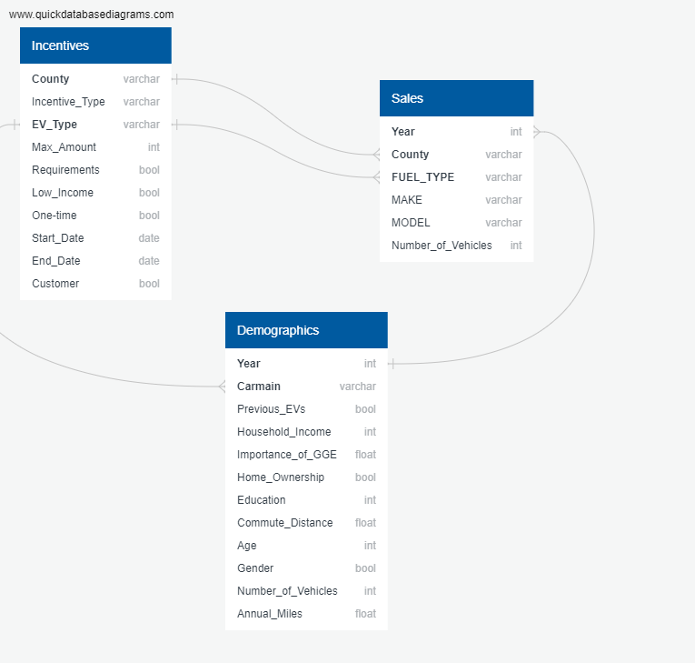

<!-- Declutter as we move forward!
      - Comment out what you still want to reference but don't want to present
        - This works well for README conflicts as well, we can discuss which version we'd like to keep when we can meet live
      - Simplify our writing, most people aren't going to want to look at too much
        - Play with formatting to draw attention where we really want it
        - Image sizing and formatting
        - Links -->
# California EV Dreams
A collaborative project to determine what factors drive adoption of electric vehicles in California.

## Table of contents
* [Overview of Project](#overview-of-project)
* [Data Collection and Cleaning](#data-collection-and-cleaning)
* [Database Model](#database-model)
* [Machine Learning Model](#machine-learning-model)
* [Results](#results)
* [Summary](#summary)
* [Future Opportunities](#future-opportunities)

### Resources
- Data Source: CA_county_incentives.csv, demographics.csv, ZEV_Sales.csv, CA_pop_2015-2022.csv
- Tools: Python 3.7.13, Jupyter Notebook, Excel, SQL, Tableau, Google Slides, HTML, CSS

## Overview of Project
We will be looking within California counties to determine any relevant factors that contribute most to EV purchases. The primary data point we will be using for our analysis is the total amount of incentives offered by county. As supplementary factors, we will be looking at demographic data to identify any correlation between household income, commuter miles driven, etc, and EV adoption. Using this analysis we hope to be able to accurately predict whether someone will buy an EV, and present to manufacturers the strengths and weaknesses in their market and potential improvements that can be made.

Hypothesis: The 3 major factors improve EV adoption in counties with at least X values for those factors.
- What is the opportunity in identifying a gap in this dataset?
- What is the market opportunity?
- Which counties in CA should EV manufacturers focus their marketing?
- Should EV manufacturers be encouraging implementation of incentives to drive sales?

## Data Collection and Cleaning
<!-- This comment is hidden from public: Add bullet points and explain changes made to original datasets -->
All datasets are for the state of California, we focused our efforts on the years 2015 to present.
- Found CA incentives data on [driveclean.ca.gov](https://driveclean.ca.gov/search-incentives)
  - Used provided information and resource links to create CA_county_incentives.csv
  - Emailed organizations for additional info, like start and end dates, if missing
  - Categorized by EV type and added columns for Requirements, Low Income eligibilty, Customer eligibilty, and One-time Use
- The [demographics](https://datadryad.org/stash/dataset/doi:10.25338/B8P313) dataset contains socioeconomic data of EV owners in CA
  - The dataset covers the years 2015 to 2018
    - [Research papers](https://www.sciencedirect.com/org/science/article/pii/S0144164722003397#:~:text=The%20literature%20identifies%20the%20following%20external%20factors%20as%20having%20the,and%20public%20visibility%2Fsocial%20norms.) indicate that the factors (in this dataset) for EV ownership haven't changed significantly
  - Removed null values and unnecessary columns
  - Changed column names for SQL table and sampled 50% of cleaned data 
- [ZEV sales](https://www.energy.ca.gov/data-reports/energy-almanac/zero-emission-vehicle-and-infrastructure-statistics/new-zev-sales) data contains number of EVs purchased in the state of CA
  - Grouped by county and year
  - Changed fuel types to match incentives dataset values
  - Added percentage of state sales per year
- Population estimates by county from [2010](https://dof.ca.gov/forecasting/demographics/estimates/estimates-e6-2010-2021/) to [2022](https://dof.ca.gov/forecasting/demographics/estimates/e-5-population-and-housing-estimates-for-cities-counties-and-the-state-2020-2022/) was found on dof.ca.gov
  - Added percentage of state population

## Database Model
<!--  -->
- Used an AWS Relational Database and SQL
- New tables for county sales per year, county population per year, and average demographics per year were made
- Joined sales and population by year and county
- Planning to join sales, population, demographics, and incentives by year and county
  - Demographics are not separated by county and only account for 2015-2018
    - We would apply averages statewide and mention the gap in the dataset
  - Incentives by county and year will require conditional looping
    - Incentives need to be checked and added to count for county and year
    - State-wide incentives will be added to counts for all counties in existing years
    - Max amount needs to be calculated for county and year
      - Calculate non-customer max amount, add in max customer incentive

## Machine Learning Model
- In evaluating our data, we considered all points that ultimately would support our topic;
  - Do the number of incentives offered in counties of California contribute to EV sales?
- After initial evaluation we identified that the incentives and sales data would ultimately provide the best model for our hypothesis.
- The demographics data would serve best as supporting data. 
  - Our Dependent variables were: Ownership/Sales
  - Our Independent variables were: Income, Incentives, Length of Commute, etc.
    - The final 3 highest correlated factors were determined by multiple linear regression analysis
<!-- Outputs label(s) for input data
  - p-values of top 3 correlated factors
  - Accuracy of nn model prediction of EV ownership -->
- Due to COVID-19 creating large variance, we will not include 2020-2021 in our analysis

## Results
<!-- Visualizations or bullet points for presentation -->

## Summary
<!-- Answer our questions, did this turn out as expected? If not, what surprised us? Quick notes for manufacturers -->

### Limitations
<!-- Where did we struggle? What could have been better? What was lacking? -->

## Future Opportunities
<!-- Where can we go from here? -->
- Given more time for data exploration, one of the factors we would consider is ethnic and racial diversity in each county. Does this matter and or play a part in the breakdown of sales by county? 
- Another factor we would consider is age. At a very high level, the demographics data showed that the average age of an EV owner in counties across California is 50. This highglighted a major opportunity for manufacturers to tap into a younger demographic. Perhaps manufacturers could stand to build a customer centric approach to attract younger generations to bridge the gap. 

